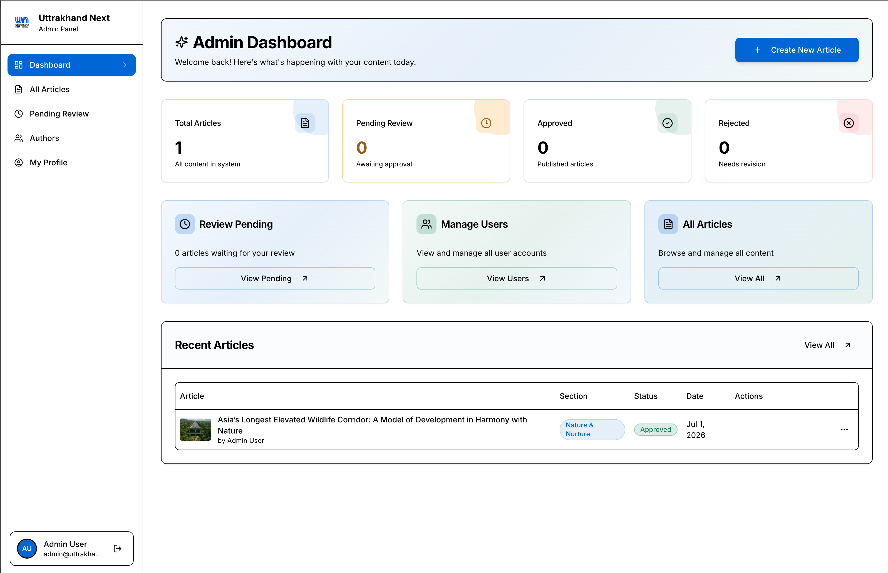
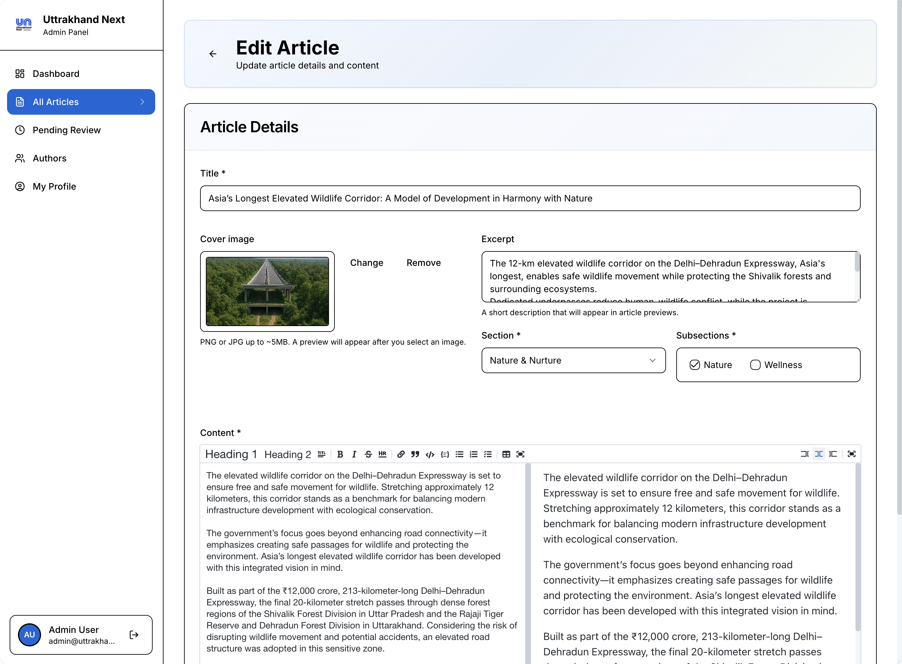

# Uttarakhand Next

> **A premium editorial platform documenting the socio-economic and cultural evolution of the Himalayan state of Uttarakhand.**

Uttarakhand Next is a production news & long-form journalism platform delivered for a real client. This repository is published as a showcase of the engineering work — the client has kindly permitted us to open-source the frontend so that others can see how we approach real-world editorial products.

Built by **BasicTech** — a small consultancy focused on shipping serious software for serious clients.

---

## Table of Contents

- [Screenshots](#screenshots)
- [What it Does](#what-it-does)
- [Tech Stack](#tech-stack)
- [Architecture at a Glance](#architecture-at-a-glance)
- [Project Structure](#project-structure)
- [Engineering Principles](#engineering-principles)
- [Testing Strategy](#testing-strategy)
- [Getting Started](#getting-started)
- [Scripts](#scripts)
- [Environment Variables](#environment-variables)
- [Deployment](#deployment)
- [About BasicTech](#about-basictech)

---

## Screenshots

### Public Home Page
A magazine-style landing experience with a featured hero, curated grid, and section rails. Built to look editorial first, technical second.


### Section Page
Each section (Politics, Culture, Environment, etc.) has its own dedicated feed with server-driven pagination and section-scoped filters.


### Admin Dashboard
A role-aware admin surface for managing articles, moderating pending submissions from authors, and managing users.



### Article Editor
A distraction-free Markdown editor with live preview, cover-image upload with client-side compression, and structured metadata.



---

## What it Does

Uttarakhand Next is a full editorial CMS + public reading experience:

- **Public reader experience** — Home, sections, article detail, search, responsive layout tuned for long-form reading.
- **Author workflow** — Authors log in, draft articles in a Markdown editor, upload cover imagery, and submit for moderation.
- **Admin workflow** — Admins moderate the pending queue, publish/reject articles, manage the author roster, and edit any article.
- **Role-based access** — A single UI serves both admin and author roles, gated by `AuthGuard` at the route level.
- **Real backend, real content** — Backed by a GraphQL API over a MySQL store. No mocks, no fake fixtures in production paths.

---

## Tech Stack

| Layer                | Choice                                              | Why                                                                                     |
| -------------------- | --------------------------------------------------- | --------------------------------------------------------------------------------------- |
| Framework            | **Next.js 16** (App Router) + **React 19**          | Server components where they help, client interactivity where it matters.               |
| Language             | **TypeScript 5.7** (strict)                         | No `any` in feature code; typed GraphQL responses end-to-end.                           |
| Data                 | **Apollo Client 3** over **GraphQL**                | Normalized cache, `cache-and-network` policy, per-field key args for pagination.        |
| Styling              | **Tailwind CSS 3.4** + design tokens                | Zero inline styles, zero hardcoded colors — everything flows through the design system. |
| UI Primitives        | **Radix UI** + **shadcn-style** `src/ui` atoms      | Accessible, unstyled primitives composed into our own atomic design system.             |
| Editor               | **@uiw/react-md-editor**                            | Familiar Markdown authoring with live preview.                                          |
| Image handling       | **next/image** + **browser-image-compression**      | Client-side compression before upload keeps the backend cheap and the reader fast.      |
| Fonts                | **Inter** + **Playfair Display** (via `next/font`)  | Editorial pairing — sans for UI, serif display for headlines.                           |
| Notifications        | **sonner**                                          | Lightweight, accessible toasts.                                                         |
| Testing              | **Cypress 15** (E2E + integration, real backend)    | We test what a user actually does, against a real GraphQL server.                       |
| Lint / Format        | **ESLint 9** (flat config) + **Prettier**           | Enforced at PR time.                                                                    |

---

## Architecture at a Glance

The core rule of the codebase is a strict, one-way flow:

```
 UI  ─▶  Hooks  ─▶  Data (GraphQL)
```

- **UI components never fetch data.**
- **Hooks never render UI.**
- **GraphQL never appears in UI files.**

This separation is the reason a junior can be productive on day one and a senior can refactor safely. Every file has one job.

### Atomic Design, applied pragmatically

| Layer      | Location                          | Purpose                                    | Can use hooks? | Can fetch? |
| ---------- | --------------------------------- | ------------------------------------------ | -------------- | ---------- |
| Atoms      | `src/ui`                          | Pure primitives (Button, Card, Input)      | No             | No         |
| Molecules  | `features/*/ui/molecules`         | One meaningful thing (ArticleCard)         | No             | No         |
| Organisms  | `features/*/ui/organisms`         | Composed units with logic (ArticleGrid)    | **Yes**        | No         |
| Templates  | `features/*/ui/templates`         | Layout scaffolding only                    | No             | No         |
| Pages      | `src/app/**`                      | Compose organisms, call hooks, pass props  | Yes            | No*        |

\* Pages call hooks — those hooks are the only thing that touches GraphQL.

### Feature-Driven Ownership

Every domain concept — `article`, `auth`, `user`, `home` — owns its own vertical slice:

```
features/article/
├── ui/
│   ├── molecules/          # ArticleCard, ArticleMeta, ...
│   └── organisms/          # ArticleGrid, ArticleDetail, ArticlesTable, ...
├── hooks/                  # useArticles, useCreateArticle, useSubmitArticle, ...
├── data/                   # GraphQL queries, mutations, fragments
└── types.ts                # Typed contracts
```

No cross-feature imports of internal files. Features expose intent, not implementation.

---

## Project Structure

```
src/
├── app/                     # Next.js App Router — pages only
│   ├── page.tsx             # Public home
│   ├── section/[section]/   # Section feed
│   ├── articles/[id]/       # Article detail
│   ├── login/               # Role-based login
│   ├── admin/               # Admin dashboard (moderation, users, articles)
│   └── author/              # Author dashboard (my articles, drafts, submit)
│
├── ui/                      # Atoms — pure UI primitives (shadcn-style)
├── components/              # Cross-feature molecules & organisms
├── features/                # article / auth / user / home vertical slices
├── graphql/                 # Apollo client, cache config, error policy
├── providers/               # ApolloProvider, AuthProvider
├── hooks/                   # Global hooks (useDebounce, useMobile)
├── lib/                     # api.ts, utils.ts
├── types/                   # common.ts, enums.ts, public.ts
└── styles/                  # globals.css
```

---

## Engineering Principles

These aren't nice-to-haves. They are enforced in the codebase and in review.

### 1. Strict architectural boundaries
UI, hooks, and data live in different folders and never bleed into each other. A GraphQL import inside a `.tsx` component fails review.

### 2. Feature ownership, not layer soup
Adding a feature means creating a folder. Removing a feature means deleting one. No hunting through five global `services/` and `utils/` folders.

### 3. Typed end-to-end
GraphQL responses are typed. Hooks return typed shapes. Components consume typed props. `tsc --noEmit` is part of CI.

### 4. Design tokens, not magic numbers
Colors, fonts, and text sizes come from `tailwind.config.ts`. Arbitrary values like `text-[11px]` or hex colors don't ship.

### 5. Accessibility by default
Every interactive control is built on Radix primitives (dialogs, menus, tooltips, tabs, switches). Keyboard nav and focus management come for free.

### 6. Real backend, real tests
No GraphQL mocking in tests. A one-command script boots the backend in Docker, seeds users, starts the frontend, and runs the full Cypress suite.

### 7. Editorial-grade UI
Fonts, spacing, and hierarchy are treated as first-class product concerns — not an afterthought bolted on to a functional prototype.

---

## Testing Strategy

We use **Cypress** exclusively, split into two layers:

### E2E (`cypress/e2e/`)
Full user journeys against a real backend — login flows, moderation workflows, article publishing, section browsing.

### Integration (`cypress/integration/`)
Focused feature behaviour — grid rendering, auth guards, tables, sidebars — still browser-based, still against a real GraphQL server.

### One-command test run

```bash
yarn test
```

Under the hood, `scripts/run-tests.sh`:

1. Clones the backend repo if missing.
2. Boots MySQL + the Node GraphQL server via `docker-compose`.
3. Waits for the GraphQL endpoint to be healthy.
4. Seeds Cypress test users via GraphQL mutations.
5. Starts the Next.js frontend on port 3001.
6. Runs every E2E and integration spec.
7. Tears everything down on exit — including on failure, via `trap`.

Deterministic. Reproducible. No "works on my machine".

---

## Getting Started

### Prerequisites

- **Node.js** 20+ (managed via `volta` or `nvm`)
- **Yarn** (or `npm`)
- **Docker** + **docker-compose** (only needed to run the test suite locally)
- Access to the GraphQL backend (public URL configured by default; override via env for local development)

### Install

```bash
yarn install
```

### Run the dev server

```bash
yarn dev
```

The app runs on **[http://localhost:3001](http://localhost:3001)**.

### Build for production

```bash
yarn build
yarn start
```

---

## Scripts

| Command                | Purpose                                                            |
| ---------------------- | ------------------------------------------------------------------ |
| `yarn dev`             | Start Next.js dev server on port 3001                              |
| `yarn build`           | Production build                                                   |
| `yarn start`           | Serve the production build                                         |
| `yarn lint`            | Run ESLint                                                         |
| `yarn lint:fix`        | Auto-fix lint issues                                               |
| `yarn format`          | Format `src/**` with Prettier                                      |
| `yarn format:check`    | Verify formatting without writing                                  |
| `yarn type-check`      | Strict TypeScript check (`tsc --noEmit`)                           |
| `yarn test`            | Full E2E + integration run against a Dockerised backend            |
| `yarn cy:open`         | Open Cypress interactive runner                                    |
| `yarn cy:run`          | Run all Cypress specs headless                                     |
| `yarn cy:run:e2e`      | Run only E2E specs                                                 |
| `yarn cy:run:integration` | Run only integration specs                                      |

---

## Environment Variables

Create a `.env.local` in the project root:

```env
NEXT_PUBLIC_GRAPHQL_URL=http://localhost:3000/graphql
```

If unset, the client falls back to the deployed backend URL (see `src/graphql/client.ts`). Auth tokens are stored in `localStorage` under `auth_token` and attached to every request via an Apollo `setContext` link.

---

## Deployment

The app is a standard Next.js 16 application and deploys cleanly to:

- **Vercel** (zero config)
- **Any Node host** — `yarn build && yarn start`
- **Docker** — a Dockerfile can be added trivially; the app has no filesystem dependencies at runtime beyond `public/`.

Set `NEXT_PUBLIC_GRAPHQL_URL` to point at the production backend.

---

## About BasicTech

**BasicTech** is a boutique software consultancy. We take on a small number of client projects and treat each one like our own product.

This project is one of those. The client — thank you — agreed to let us open-source the frontend so prospective clients and engineers can see the shape of our work: how we structure code, how we test, how we ship.

If you're evaluating consultancies and this codebase reads well to you, that's the point. Talk to us.

---

## License

This repository is published for showcase purposes. Please contact BasicTech before reusing substantial portions of the code in commercial work.
